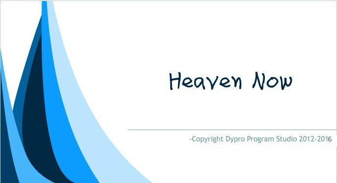

# Heaven Now 代码托管
Heaven Now 现在是一个开源项目，隶属于DYPro Program Studio，是利用Basic语言编写的，曾计划依凭一个综合的处理终端建立各个操作系统的生态，从2018年7月29日后起由于作者时间原因已经不再是一个积极开发的项目了，但仍会维护，始于2013年    

目前各平台最新版本
- Windows：2017ProVision ，最后更新于2018年8月2日
  - 版本特色：(**Build 2018437**)
    1. 富文本编辑
    2. 表格处理(csv)
    3. 涂鸦和图片处理
    4. Digital Lab设备接入和实验分析平台（Fraity Lab协议的实验设备）
    5. 串口调试和绘图器
    6. 复杂函数图像绘制
    7. 基于TCP和UDP协议实现的聊天、游戏、实时画板的综合平台
    8. 支持32种主流多媒体文件查看，支持Win10风格置顶磁贴
    9. 自动更新（已失效）
- Linux: 2019.006.1（暂未发行）,2019.005.1 ，最后更新于2019年10月3日
  - 版本特色：(**Build 2019006**)
    1. 富文本编辑
    2. 涂鸦
- Android: 2016+ ，最后更新于2017年4月22日
  - 版本特色：(**Build 2017054**)
    1. 文本编辑
    2. 云同步（已失效）

欢迎各位在之前的版本基础上帮助这个Heaven Now这个软件平台不断前进！

